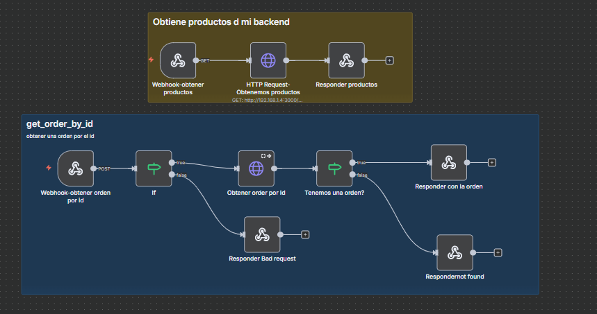

# 🤖 Flujo Automatizado — Agente IA con Telegram, Contactos y Gmail

Este flujo implementa un **agente conversacional inteligente** que recibe mensajes desde Telegram, procesa las solicitudes usando un modelo de IA, consulta una hoja de contactos y puede **enviar correos automáticamente** mediante Gmail.

Funciona como un asistente personal conectado a tus contactos y servicios externos.

---

## 🧠 Flujo Visual



---

## 📘 Descripción General

El flujo se activa cada vez que un usuario envía un mensaje a un bot de Telegram. A partir de ahí:

1. **Telegram Trigger recibe el mensaje** del usuario.  
2. El mensaje se envía al **AI Agent**, que interpreta la intención usando OpenAI.  
3. El agente tiene acceso a:
   - **Memoria simple**, para recordar el contexto de la conversación.
   - **Hoja de contactos**, para buscar información o correos electrónicos.
   - **Gmail**, para enviar correos según lo que el usuario solicite.
4. El agente genera dos respuestas:
   - Una **respuesta directa** enviada nuevamente al usuario en Telegram.
   - Una **acción opcional**, como enviar un correo a la persona solicitada.
5. Finalmente, se usa **Send a text message** para enviar la respuesta del bot a Telegram.

---

## ⚙️ Componentes Principales

| Módulo | Tipo | Descripción |
|--------|------|-------------|
| **Telegram Trigger** | Disparador | Activa el flujo cuando el bot recibe un mensaje. |
| **AI Agent** | Inteligencia Artificial | Procesa el mensaje del usuario, accede a memoria, contactos y decide acciones. |
| **OpenAI Chat Model** | Modelo de IA | Interpreta la intención del usuario y genera respuestas naturales. |
| **Simple Memory** | Memoria | Guarda información contextual para mantener la coherencia de la conversación. |
| **Google Sheets (contactos)** | Herramienta | Permite al agente consultar correos o datos de contactos almacenados. |
| **Gmail (Send a message)** | Integración | Envía correos electrónicos según solicitud del usuario. |
| **Telegram (Send a text message)** | Respuesta | Envía el mensaje final al usuario en Telegram. |

---

## 🧾 Ejemplo de Uso

El usuario escribe en Telegram:

Envía un correo a Maria solicitando la solicitud de informacion o confimacion de reunion entre muchas mas cosas

markdown
Copiar código

El agente hace lo siguiente:

1. Busca “Maria” en Google Sheets → obtiene correo.
2. OpenAI construye el mensaje.
3. Gmail envía el correo automáticamente.
4. Telegram responde:

Correo enviado correctamente a Maria.

yaml
Copiar código

---

## 📄 Estructura de la Hoja de Contactos

Google Sheets:

- **Nombre**
- **Correo**
- **Teléfono** (opcional)
- **Notas** (opcional)

Ejemplo:

| Nombre | Correo | Teléfono |
|--------|---------|----------|
| Maria | maria@example.com | 3001234567 |
| Carlos | carlos@example.com | 3019876543 |
👉 https://docs.google.com/spreadsheets/d/1Vl9uVWUtRnlGo6vjL6qiZrNcFNFgY37skRknOQXNhBw/edit?gid=0#gid=0
---

## 🚀 Ejecución con Docker

```bash
docker-compose up -d
Luego accede a n8n en:

👉 http://localhost:5678

Importa el flujo JSON desde:

bash
Copiar código
/workflows/Agente_Empresa.json
✉️ Autor
Brandon Suárez
📧 brandondulian36@gmail.com
🌐 https://github.com/BrandonGS22b