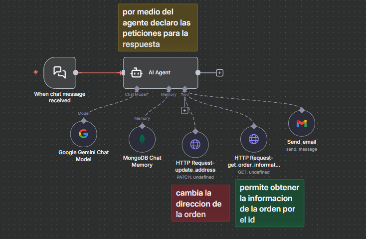

# 🤖 Flujo Automatizado — Agente IA para Gestión de Órdenes de Tienda Online

Este flujo implementa un **agente conversacional inteligente** que recibe mensajes de chat, procesa las solicitudes usando el modelo **Google Gemini**, y tiene la capacidad de **consultar y modificar información de órdenes de una tienda online** a través de servicios HTTP, además de poder **enviar notificaciones por email**.

Funciona como un asistente de gestión de pedidos, capaz de interactuar con sistemas de e-commerce (APIs) y comunicarse con los clientes por correo.

---

## 🧠 Flujo Visual



---

## 📘 Descripción General

El flujo se activa cada vez que un mensaje de chat es recibido (por ejemplo, desde una plataforma de soporte o bot de mensajería). A partir de ahí:

1. **El disparador de chat recibe el mensaje** del cliente.
2. El mensaje se envía al **AI Agent**, que interpreta la intención usando el modelo **Google Gemini Chat Model**.
3. El agente tiene acceso a:
    - **Memoria (MongoDB Chat Memory)**, para recordar el contexto de la conversación con el cliente.
    - **Herramientas de API (HTTP Requests)**, para interactuar con la base de datos de órdenes de la tienda.
    - **Gmail (Send_email)**, para enviar mensajes de correo electrónico al cliente (ej. confirmaciones o actualizaciones).
4. El agente genera una respuesta y, si es necesario, ejecuta una de sus herramientas:
    - **`HTTP Request - update_address` (PATCH)**: Usada para **cambiar la dirección de una orden** antes de su envío.
    - **`HTTP Request - get_order_information` (GET)**: Usada para **obtener el estado y detalles de la orden por su ID**.
    - **`Send_email`**: Usada para enviar un correo (ej. una notificación de envío o cambio).
5. Finalmente, el agente devuelve la respuesta adecuada al cliente.

---

## ⚙️ Componentes Principales

| Módulo | Tipo | Descripción |
|--------|------|-------------|
| **When chat message received** | Disparador | Activa el flujo cuando un mensaje llega al agente. |
| **AI Agent** | Inteligencia Artificial | Procesamiento central. Interpreta el mensaje, gestiona la memoria y decide qué herramienta usar para la orden. |
| **Google Gemini Chat Model** | Modelo de IA | Proporciona la inteligencia para interpretar la intención (NLP) del cliente y generar respuestas naturales. |
| **MongoDB Chat Memory** | Memoria | Guarda el historial de chat para mantener el contexto de la interacción con el cliente. |
| **HTTP Request - update_address** | Herramienta (PATCH) | Permite al agente **cambiar la dirección de envío** asociada a una orden existente. |
| **HTTP Request - get_order_information** | Herramienta (GET) | Permite al agente **consultar los detalles y el estado** de una orden usando su identificador (ID). |
| **Send_email** | Integración | Permite al agente **enviar correos electrónicos** (ej. para notificaciones de estado o confirmaciones). |

---

## 🧾 Ejemplo de Uso

El usuario (cliente) escribe en el chat:

```markdown
Hola, hice una compra ayer. Necesito cambiar la dirección de mi orden 12345 a Calle Falsa 123, porque me equivoqué o tambien obtener informacion.


```bash
docker-compose up -d
Luego accede a n8n en:

👉 http://localhost:5678

Importa el flujo JSON desde:

bash
Copiar código
/workflows/Agente_Empresa.json
✉️ Autor
Brandon Suárez
📧 brandondulian36@gmail.com
🌐 https://github.com/BrandonGS22b