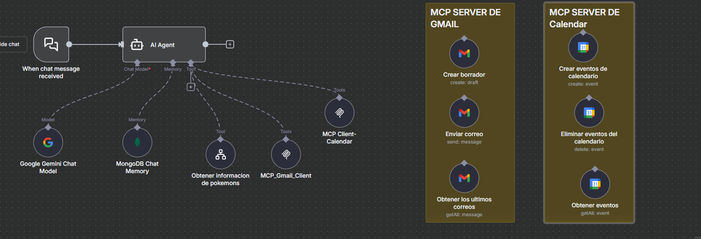
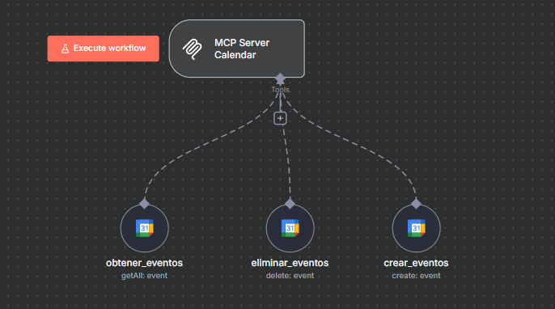
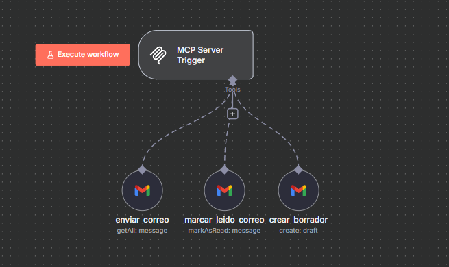
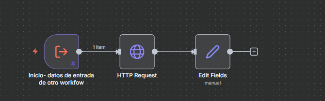

# 🧩 Flujo Automatizado — Agente de IA Personal con Herramientas MCP

Este flujo es el agente central que interpreta mensajes del usuario mediante un modelo de IA (Google Gemini), mantiene contexto con MongoDB y ejecuta acciones usando herramientas externas como Gmail, Calendar y una API de Pokémon.

---

## 🧠 Flujo Visual

  
  
  


---

## 📘 Descripción General

El agente se activa cuando llega un mensaje del usuario y decide qué acción realizar basándose en la intención detectada por IA.  
Puede:

1. Responder mensajes con IA.
2. Consultar o enviar correos mediante Gmail.
3. Crear o eliminar eventos de calendario.
4. Obtener información de Pokémon usando un sub-workflow.

El agente usa memoria en MongoDB para recordar el contexto de la conversación.

---

## ⚙️ Componentes Principales

| Módulo | Tipo | Descripción |
|--------|------|-------------|
| **When chat message received** | Disparador | Inicia el flujo ante un nuevo mensaje del usuario. |
| **AI Agent** | Lógica Inteligente | Recibe el mensaje, consulta el modelo y decide qué herramienta usar. |
| **Google Gemini Chat Model** | Modelo IA | Procesa el lenguaje natural y determina la intención. |
| **MongoDB Chat Memory** | Memoria | Guarda contexto conversacional para respuestas más coherentes. |
| **MCP_Gmail_Client** | Tool Client | Permite al agente enviar correos, crear borradores y obtener mensajes. |
| **MCP Client-Calendar** | Tool Client | Permite al agente crear, eliminar y listar eventos del calendario. |
| **Obtener información de pokemons** | Tool Interna | Llama al sub-workflow encargado de consultar la PokeAPI. |
| **MCP SERVER de Gmail** | Servidor de herramientas | Expone funciones: enviar correo, crear borrador, obtener correos. |
| **MCP SERVER de Calendar** | Servidor de herramientas | Expone funciones: crear, eliminar y obtener eventos. |

---

## 🚀 Ejecución con Docker

```bash
docker-compose up -d
Luego accede a:

👉 http://localhost:5678

E importa el flujo desde:

bash
Copiar código
/workflows/AI_Agent_Principal.json
✉️ Autor
Brandon Suárez
📧 brandondulian36@gmail.com
🌐 github.com/BrandonGS22b

yaml
Copiar código
