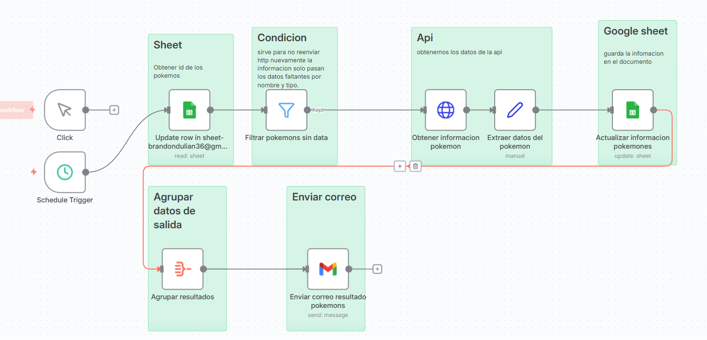

# 🧩 Flujo Automatizado — Proyecto Pokémon

Este flujo automatiza la obtención, actualización y notificación de información sobre Pokémon desde una API externa hacia una hoja de Google Sheets, utilizando **n8n**.

---
## 🧠 Flujo Visual




## 📘 Descripción General

El flujo se ejecuta de forma manual o programada y realiza los siguientes pasos:

1. **Obtiene los IDs de los Pokémon** desde una hoja de Google Sheets.
2. **Filtra** los registros que no tienen datos completos.
3. **Consulta una API externa** para obtener información de cada Pokémon (nombre, tipo, habilidades, etc.).
4. **Actualiza la hoja de Google** con los datos obtenidos.
5. **Agrupa los resultados** procesados.
6. **Envía un correo electrónico** con un resumen de los Pokémon actualizados.

---

## ⚙️ Componentes Principales

| Módulo | Tipo | Descripción |
|--------|------|-------------|
| **Click / Schedule Trigger** | Disparador | Permite ejecutar el flujo manualmente o en intervalos programados. |
| **Sheet (Read)** | Integración | Obtiene los IDs de los Pokémon desde Google Sheets. |
| **Condición (Filter)** | Lógica | Filtra los Pokémon sin información previa para evitar duplicados. |
| **API (HTTP Request)** | API Externa | Consulta la API de Pokémon para extraer los datos actualizados. |
| **Google Sheet (Update)** | Integración | Actualiza los datos del Pokémon en la hoja de cálculo. |
| **Agrupar datos de salida** | Función | Organiza la información final para su envío. |
| **Enviar correo** | Gmail | Envía un resumen con los resultados del flujo. |

---

## 🧠 Flujo Visual


> 💡 *Puedes guardar esta imagen en la carpeta `/assets` o `/docs/img` para mantener la documentación organizada.*

---

## 🧾 Ejemplo de Configuración

**Hoja de Google:**
- Nombre: `Pokémon Data`
- Columnas: `ID`, `Nombre`, `Tipo`, `Sprite Frontal`, `Sprite Frontal`

**API usada:**
GET https://pokeapi.co/api/v2/pokemon/{id}


**Correo de salida:**
- Asunto: `Reporte de Pokémon Actualizados`
- Contenido: Lista de Pokémon procesados correctamente.

---

## 🚀 Ejecución con Docker

```bash
docker-compose up -d
Luego accede a n8n en:
👉 http://localhost:5678

Importa el flujo JSON desde:
/workflows/Proyecto pokemon.json


✉️ Autor

Brandon Suárez
📧 brandondulian36@gmail.com

🌐 github.com/BrandonGS22b