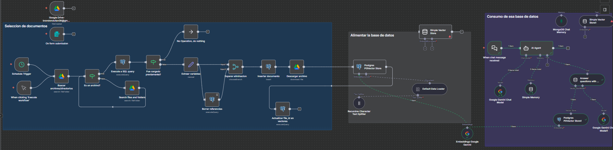

# 📚 Sistema RAG Estándar para Documentos (Retrieval-Augmented Generation)

Este flujo implementa un **Sistema RAG** que permite a un **Agente de IA** responder preguntas basándose en el contenido de una colección de documentos, asegurando que las respuestas sean precisas y estén fundamentadas en datos internos.

El sistema se divide en dos fases principales: **Indexación de Documentos** y **Consulta (Agente Conversacional)**.

---

## 🧠 Flujo Visual



---

## 1. ⚙️ Fase de Indexación (Alimentar la Base de Datos)

Esta fase se encarga de procesar documentos no estructurados y transformarlos en vectores para un almacenamiento eficiente y una posterior recuperación rápida.

### 📄 Proceso de Selección de Documentos

El flujo inicia al seleccionar documentos nuevos o actualizados para su indexación:

1. **Google Drive / On Form Submission:** Un documento puede ser iniciado manualmente o mediante la carga de un archivo.
2. **Schedule Trigger / When clicking 'Execute workflow':** Un disparador recurrente o manual inicia el proceso de indexación.
3. **Buscar archivos/directorios:** Localiza los documentos de origen, posiblemente filtrando por fecha o metadatos.
4. **Ejecutar query SQL:** Permite obtener un listado de documentos ya procesados para evitar duplicados o actualizar referencias.
5. **Es el archivo?:** Bifurcación que dirige el flujo si se procesa un archivo individual o si se está borrando un registro.
6. **Entrar variables:** Define y extrae variables necesarias (ej. ID de documento, ruta).
7. **Borrar/Descargar documentos:** Elimina referencias antiguas o descarga el documento para su procesamiento local.
8. **Actualizar file_id en vectores:** Mantiene el mapeo entre el ID del documento original y los vectores almacenados.

### 💾 Proceso de Vectorización

Aquí es donde el contenido de los documentos se transforma para ser utilizable por el Agente de IA:

1. **Recursive Character Text Splitter:** Toma el contenido del documento y lo divide en trozos (chunks) más pequeños, manteniendo el contexto dentro de cada trozo para una mejor recuperación.
2. **Google Gemini Embeddings / Google Gemini Model:** Se utiliza un modelo de *embeddings* (como el de Google Gemini) para convertir cada trozo de texto en un vector numérico de alta dimensión.
3. **Postgres Vector Store:** Los vectores generados se almacenan en una base de datos vectorial (PostgreSQL con extensión pgVector) junto con sus metadatos (ID de documento, texto original).

---

## 2. 🧠 Fase de Consulta (Consumo de la Base de Datos)

Esta fase utiliza el contenido indexado para responder de manera inteligente a las preguntas del usuario.

### 🤖 Agente Conversacional RAG

1. **When chat message received:** El flujo se activa cuando un usuario envía una pregunta al agente.
2. **AI Agent:** Es el orquestador principal. Utiliza el modelo Gemini y la memoria para gestionar la conversación.
3. **Google Gemini Chat Model:** El modelo de IA que interpreta la pregunta del usuario y genera la respuesta final.
4. **MongoDB Chat Memory / Simple Memory:** Almacena el historial de chat para que el agente recuerde el contexto de las interacciones previas.
5. **Simple Vector Store (Postgres / Default Data Loader):** El Agente usa esta herramienta para:
    * Tomar la pregunta del usuario y convertirla en un vector (utilizando el mismo modelo de *embeddings*).
    * Buscar los vectores más similares en la **Postgres Vector Store**.
    * **Recuperar** los trozos de texto originales (el contexto) de los documentos que son más relevantes a la pregunta.
6. **Generar respuesta:** El Agente toma la pregunta original del usuario *más* el contexto recuperado de la base de datos (RAG) para generar una respuesta precisa y fundamentada.

---

## ⚙️ Resumen de Componentes Clave

| Módulo | Tipo | Función Principal |
|--------|------|--------------------|
| **AI Agent** | Orquestador | Dirige la conversación, usa la memoria y decide cuándo consultar la base vectorial. |
| **Google Gemini Chat Model** | Modelo de IA | Generación de lenguaje natural y comprensión de la pregunta. |
| **Google Gemini Embeddings** | Modelo Vectorial | Transforma texto en vectores numéricos para la indexación y la búsqueda. |
| **Postgres Vector Store** | Base de Datos | Almacenamiento optimizado de los vectores de los documentos (la "memoria a largo plazo" del sistema). |
| **MongoDB Chat Memory** | Memoria Corta | Mantiene el contexto de la conversación actual del usuario. |
| **Recursive Character Text Splitter**| Preprocesamiento | Divide documentos grandes en trozos manejables para la vectorización. |

---

## 🚀 Ejecución con Docker

```bash
docker-compose up -d
Luego accede a n8n en:

👉 http://localhost:5678

Importa el flujo JSON desde:

Bash

/workflows/Sistema_RAG_Documentos.json
✉️ Autor Brandon Suárez 📧 brandondulian36@gmail.com 🌐 https://github.com/BrandonGS22b